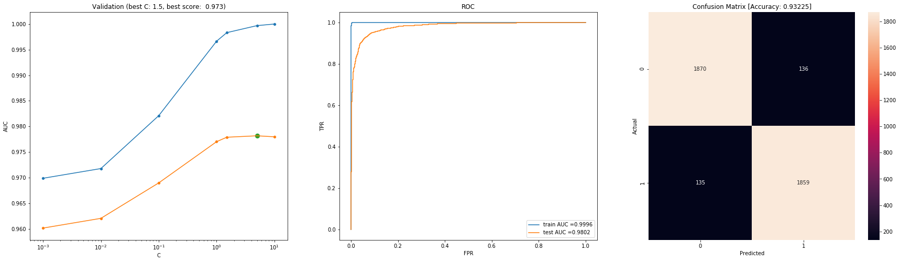
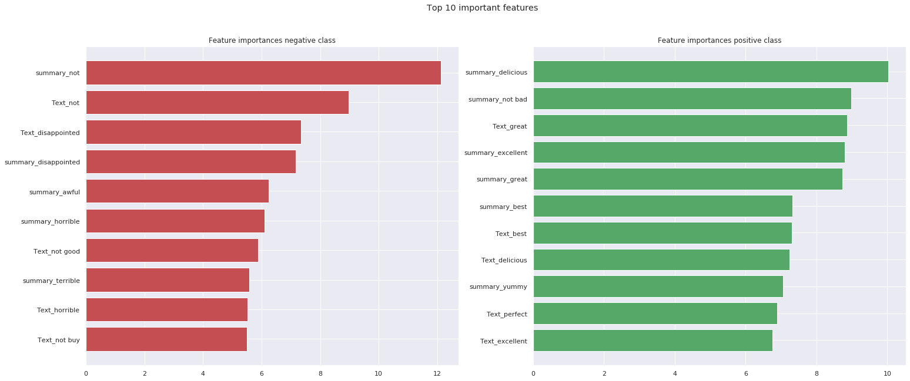

# Amazon Fine Food Reviews

- [Amazon Fine Food Reviews](#amazon-fine-food-reviews)
  - [Objective:](#objective)
  - [Dataset Description](#dataset-description)
  - [key technical aspects](#key-technical-aspects)
  - [Model Selection](#model-selection)
    - [Metric](#metric)
    - [Validation Results](#validation-results)
  - [Best model](#best-model)
    - [Featurization and Model Pipeline](#featurization-and-model-pipeline)
    - [HyperParmaeter Search space](#hyperparmaeter-search-space)
    - [Best HyperParmaeters](#best-hyperparmaeters)
    - [Validation plot](#validation-plot)
    - [Feature importance plot](#feature-importance-plot)
  - [Technologies Used](#technologies-used)

## Objective:

Amazon E-commmerce also has variety food products. Like any other E-commerces Amazon wants to make more bussiness by providing better services to its customers. One of them is recommending good products. In order to decide which products are good we can look at customer reviews who have already purchased them. This project focuses on building a classifer that predicts whether reviews are positive are negative for making informed decision.

In order to train a classifier to detect whether the review is positive or negative we need to have a label column. In the given set such info not available but, fortunately, we got a column of scores/rating which is close approximation of user liked or not liked the product. Scores less than 3 (Rating 2 or 1) we are pretty sure that label is negative and for more than 3 (Rating 3 or 4) it's positive. But, we are sure about examples with score 3 (kind of neutral). so we drop those rows.

## Dataset Description

source: https://www.kaggle.com/snap/amazon-fine-food-reviews

**Data includes**:

* Reviews from Oct 1999 - Oct 2012
* 568,454 reviews
* 256,059 users
* 74,258 products
* 260 users with > 50 reviews

**Columns**
* Id - unique row identifier
* ProductId - unique identifier for the product
* UserId - unqiue identifier for the user
* ProfileName - Name of user
* HelpfulnessNumerator - number of users who found the review helpful
* HelpfulnessDenominator - number of users who indicated whether they found the review helpful or not
* Score - rating between 1 and 5
* Time - timestamp for the review
* Summary - brief summary of the review
* Text - text of the review


## key technical aspects
After data exploration and visualization various data prepossing steps are selected after of data. Following are noticeable ones among them.

- Basic features like charecter count, word count etc extracted from review text added.
  
- BOW, TFIDF, Word2Vec, Average Word2Vec, Tfidf weighted word2vec featurization tecniques are tried on both ```summary``` and ```Review``` text.

- As data is highly imbalanced, data was downsampled. For training, 10000 samples were drawn from both classes.
   
- Trained various models like KNN, Naive Bayes, Logistic Regressin, Decision Tree XGBoost with hyperparameter tuning to select best model. **Logistic Regression** turns out be best model with highest AUROC of **0.982** with  and **93%** accuracy.


## Model Selection

### Metric

* AUROC (Area Under the Receiver Operating Characteristic curve) is used as metric. It combines both **True positive rate** (TPR) and **False positive rate** (FPR) into one single metric and balances both.

### Validation Results

Vectorizer | Model  | Type | Best AUROC | Accuracy
-----------|--------|------|----------|---------
BOW | KNN | brute | 0.772 | -
TFIDF | KNN | brute | 0.895 | -
AVG W2V | KNN | brute | 0.861 | -
TFIDF Weighted W2V | KNN | brute | 0.834 | -
BOW | KNN | kd_tree | 0.792 | -
TFIDF | KNN | kd_tree | 0.873 | -
AVG W2V | KNN | kd_tree | 0.861 | -
TFIDF Weighted W2V | KNN | kd_tree | 0.834 | -
BOW | Naive-Bayes | - | 0.97 | -
TFIDF | Naive-Bayes | - | 0.977 | -
BOW | Logistic Regression | L2 | 0.97 | 0.919
**TFIDF** | **Logistic Regression** | **L2** | **0.982** | **0.932**
AVG W2V | Logistic Regression | L2 | 0.931 | 0.859
TFIDF Weighted W2V | Logistic Regression | L2 | 0.921 | 0.849
BOW | SVM (Calibrated) | Linear | 0.972 | 0.92
TFIDF | SVM (Calibrated) | Linear | 0.975 | 0.925
AVG W2V | SVM (Calibrated) | Linear | 0.919 | 0.849
TFIDF Weighted W2V | SVM (Calibrated) | Linear | 0.909 | 0.833
BOW | SVM (Calibrated) | RBF | 0.961 | 0.893
TFIDF | SVM (Calibrated) | RBF | 0.962 | 0.898
AVG W2V | SVM (Calibrated) | RBF | 0.932 | 0.864
TFIDF Weighted W2V | SVM (Calibrated) | RBF | 0.923 | 0.848
BOW | Decision Tree | - | 0.835 | 0.786
TFIDF | Decision Tree | - | 0.827 | 0.782
AVG W2V | Decision Tree | - | 0.865 | 0.791
TFIDF Weighted W2V | Decision Tree | - | 0.848 | 0.775
TFIDF | Random Forest | - | 0.949 | 0.88
AVG W2V | Random Forest | - | 0.921 | 0.845
TFIDF Weighted W2V | Random Forest | - | 0.913 | 0.836
BOW | GBDT |  | 0.964 | 0.9

## Best model 

### Featurization and Model Pipeline
``` python
clf = Pipeline([
    ('features',FeatureUnion([
            ('numerics', Pipeline([('extract',ColumnExtractor(['Cleaned_text'])),
            ('summerize',Text_Summerizer()),
            ('selected_extract',ColumnExtractor(['count_letters', 'count_word', 'count_unique_word']))])),
        ('Summary_vectorizer',Pipeline([
            ('extract',ColumnExtractor(['Summary'])),
            ('converter', Converter()),
            ('vectorize',TfidfVectorizer())])),
        ('Text_vectorizer',Pipeline([
            ('extract',ColumnExtractor(['Cleaned_text'])),
            ('converter', Converter()),
            ('vectorize',TfidfVectorizer())]))
        ]
    )),
    ('model_fit',LogisticRegression(max_iter = 1000))])
```
### HyperParmaeter Search space

``` python
param_grid = {'features__Summary_vectorizer__vectorize__binary' : [True, False],
              'features__Summary_vectorizer__vectorize__ngram_range': [(1, 1),(1, 2)],
              'features__Summary_vectorizer__vectorize__min_df':[1,5],
              'features__Text_vectorizer__vectorize__binary' : [True, False],
              'features__Text_vectorizer__vectorize__ngram_range': [(1, 1),(1, 2)],
              'features__Text_vectorizer__vectorize__min_df':[1,5,10],
              'features__Text_vectorizer__vectorize__max_features':[None,5000,10000],
              'model_fit__C': [round(0.001*10**i,6) for i in range(5)]+[1.5,5,10]}
```

### Best HyperParmaeters

``` python 
{'features__Summary_vectorizer__vectorize__binary': False,
 'features__Summary_vectorizer__vectorize__max_features': None,
 'features__Summary_vectorizer__vectorize__min_df': 1,
 'features__Summary_vectorizer__vectorize__ngram_range': (1, 2),
 'features__Text_vectorizer__vectorize__binary': True,
 'features__Text_vectorizer__vectorize__max_features': None,
 'features__Text_vectorizer__vectorize__min_df': 5,
 'features__Text_vectorizer__vectorize__ngram_range': (1, 2),
 'model_fit__C': 5}
```

### Validation plot




### Feature importance plot



## Technologies Used


[](https://scikit-learn.org/stable/#)
[](https://www.nltk.org/)
[](https://radimrehurek.com/gensim/models/word2vec.html)
[](https://www.sqlite.org/)
